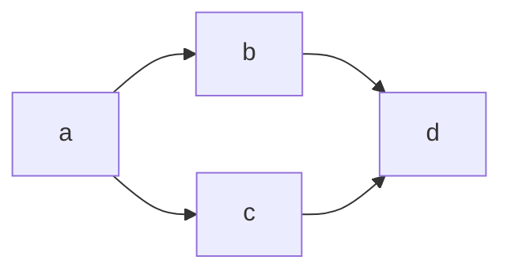

[@Qiita(Qiita キータ)](/Qiita)in[Qiita株式会社](/organizations/qiita-inc)Last updated at Posted at 2012-12-26

Markdown記法のチートシートです。

記法は[GitHub Flavored Markdown](https://github.github.com/gfm/)に準拠し、一部拡張しています。  
Qiitaでシンタックスハイライト可能な言語一覧については、 [シンタックスハイライト可能な言語](http://qiita.com/Qiita/items/e84f5aad7757afce82ba) をご覧下さい。

## Code - コードの挿入

### Code blocks - コードブロック

たとえば、「Ruby」で記述したコードをファイル名「qiita.rb」として投稿したいときは、 **バッククオート（`` ` ``）** か **チルダ（`~`）** を使用して以下のように投稿するとシンタックスハイライトが適用されます。  
コードブロック内でコードブロックを書きたい場合は異なる記号を使うことで書けます。

書き方

```ruby:qiita.rbputs 'The best way to log and share programmers knowledge.'```

**結果**

qiita.rb

puts'The best way to log and share programmers knowledge.'

#### Diffと他の言語のシンタックスを同時に使う

Qiitaでサポートしている各シンタックスに、新たに`diff_*`という名前をつけることでDiffを追加することができます。  
`-`、`+`を行の先頭に書くことでDiffを表現することができます。

[](https://qiita-user-contents.imgix.net/https%3A%2F%2Fqiita-image-store.s3.ap-northeast-1.amazonaws.com%2F0%2F158501%2F45b09c16-3cf1-4a2d-751b-f8809da12831.png?ixlib=rb-4.0.0&auto=format&gif-q=60&q=75&s=b4f5b13ea8c3193b51c13c1860f74159)

### Code spans - コードスパン

また、コードをインライン表示することも可能です。

書き方

`puts 'Qiita'` と書くことでインライン表示することも可能です。

**結果**

`puts 'Qiita'` と書くことでインライン表示することも可能です。

#### コードスパン内でバッククオートを使う

コードスパン内でバッククオートを使いたいときは、開始・終了のバッククオートをn+1個で囲みます。

書き方

`` `バッククオート` `` や ``` ``2連続バッククオート`` ``` も記述できます。

**結果**

`` `バッククオート` `` や ` ``2連続バッククオート`` ` も記述できます。

#### コードスパンの中身がCSSの <color> 型

コードスパンの中身が [CSS の `<color>` 型](https://developer.mozilla.org/ja/docs/Web/CSS/color_value)の RGB 16進数表記、 `rgb()`、 `rgba()`、 `hsl()`、 `hsla()` の場合、横にその色が表示されます。

書き方

`#ffce44``rgb(255,0,0)``rgba(0,255,0,0.4)``hsl(100, 10%, 10%)``hsla(100, 24%, 40%, 0.5)`

**結果**

`#ffce44`  
`rgb(255,0,0)`  
`rgba(0,255,0,0.4)`  
`hsl(100, 10%, 10%)`  
`hsla(100, 24%, 40%, 0.5)`

### Gist連携について → 2019年1月8日提供終了

[記事投稿時におけるGist連携の提供終了のお知らせ](https://blog.qiita.com/close-gist-coordination/)

## Format Text - テキストの装飾

### Headings - 見出し

`#`とテキストの間に半角スペースを入れてください。

目次(TOC)は記事内の見出しを元に自動生成し、右に自動挿入されます。

書き方

# これはH1タグです## これはH2タグです###### これはH6タグです

**結果**

## これはH1タグです

## これはH2タグです

###### これはH6タグです

### Emphasis / Strong Emphasis - 強調・強勢

前後に **半角スペース** か **改行文字** を入れてください。

書き方

_ か * で囲むとHTMLのemタグになります。Qiitaでは *italic type* になります。__ か ** で囲むとHTMLのstrongタグになります。Qiitaでは **太字** になります。

**結果**

\_ か \* で囲むとHTMLのemタグになります。Qiitaでは *italic type* になります。  
\_\_ か \*\* で囲むとHTMLのstrongタグになります。Qiitaでは **太字** になります。

### Strikethrough - 打ち消し線

前後に **半角スペース** か **改行文字** を入れてください。

書き方

打ち消し線を使うには ~~ で囲みます。 ~~打ち消し~~

**結果**

打ち消し線を使うには ~~ で囲みます。 ~~打ち消し~~

### Details - 折りたたみ

HTMLの詳細折りたたみ要素を使えます。  
追加情報としたい内容を、`details`タグで囲みます。そして、要約として表示したい文章を`summary`タグで記載します。  
`open`属性をつけると折りたたみを広げた状態にできます。

HTMLタグの下には空行が必要です。

書き方

<!-- open属性なし --><details><summary>サンプルコード（open属性なし）</summary>(上に空行が必要)```rbputs'Hello, World'```</details><!-- open属性あり --><detailsopen><summary>サンプルコード（open属性あり）</summary>(上に空行が必要)```rbputs'Hello, World'```</details>

**結果**

サンプルコード（open属性なし）

(上に空行が必要)

puts'Hello, World'

サンプルコード（open属性あり）

(上に空行が必要)

puts'Hello, World'

### Note - 補足説明

目を引く形で補足説明をしたい場合、補足したい内容を`:::note info`と `:::` で囲みます。  
補足したい内容と`:::note info` と `:::` はそれぞれ別の行にする必要があります。

noteの後の`info`は省略可能です。  
また、 noteの後に`warn`をつけると警告メッセージに、`alert`をつけるとより強い警告メッセージとして表現することができます。

書き方

:::note info
インフォメーション
infoは省略可能です。::::::note warn
警告
○○に注意してください。::::::note alert
より強い警告
○○しないでください。:::

**結果**

インフォメーション  
infoは省略可能です。

警告  
○○に注意してください。

より強い警告  
○○しないでください。

#### ノート記法内でのMarkdown記法の使用

現在ノート記法内でサポートしているMarkdown記法は以下となっています。

リスト強調打ち消し線コードスパンリンク画像コードブロック

## Lists - リスト

### Bullet List - 順序なしリスト

文頭に`*``+``-`のいずれかを入れると順序なしリストになります要点をまとめる際に便利です`*``+``-`の後には **スペースが必要です**

### Ordered List - 番号付きリスト

文頭に`数字.`を入れると番号付きリストになります`数字.`の後には **スペースが必要です**ネストする時には **段落と同じ数のスペースが必要です**

番号をエスケープする場合は、`数字.`の`.`の前にバックスラッシュ`\`を挿入します。

**例**

書き方

3\. リスト
エスケープされています

**結果**

3\. リスト  
エスケープされています

### Description List - 説明リスト

HTMLの`<dl>`タグをそのまま使うことで実現できます。

書き方

<dl><dt>リンゴ</dt><dd>赤いフルーツ</dd><dt>オレンジ</dt><dd>橙色のフルーツ</dd></dl>

**結果**

リンゴ

赤いフルーツ

オレンジ

橙色フルーツ

説明リスト内ではMarkdown記法ではなくて、HTMLタグを使って修飾しなければならないので、正しくは次のようになります。

書き方

<dl><dt>リンゴ</dt><dd> とても<strong>赤い</strong>フルーツ </dd></dl>

**結果**

リンゴ

とても**赤い**フルーツ

Markdown記法とHTMLタグの対応は次のようになっています。

修飾

Markdown

HTML

ボールド

`**  **`

`<strong></strong>`

イタリック

`_  _`

`<em></em>`

コード

` `` `

`<code></code>`

リンク

`[text](url)`

`<a href="url">text</a>`

### Checkbox - チェックボックス

順序なしリストの記述の後ろに`[ ]`を入れるとチェックボックスが生成されます。  
チェックが入った状態のボックスを生成する場合は`[x]`を入力します。  
**前後にスペースが必要です。**

書き方

- [ ] タスク1- [x] タスク2

**結果**

タスク1タスク2

## Blockquotes - 引用

書き方

> 文頭に>を置くことで引用になります。> 複数行にまたがる場合、改行のたびにこの記号を置く必要があります。> **引用の上下にはリストと同じく空行がないと正しく表示されません**> 引用の中に別のMarkdownを使用することも可能です。> > > これはネストされた引用です。

**結果**

> 文頭に>を置くことで引用になります。  
> 複数行にまたがる場合、改行のたびにこの記号を置く必要があります。  
> **引用の上下に空行がないと正しく表示されません**  
> 引用の中に別のMarkdownを使用することも可能です。
> 
> > これはネストされた引用です。

## Horizontal rules - 水平線

下記は全て水平線として表示されます

書き方

* * *
***
*****- - -
---------------------------------------

## Links - リンク

タイトル付きのリンクを投稿できます。 (タイトルは、リンク上にマウスホバーすることで表示されます。)

書き方

[リンクテキスト](URL"タイトル")

**例**

書き方

[Qiita](http://qiita.com"Qiita Home")

**結果**  
[Qiita](http://qiita.com "Qiita Home")

タイトルなしのリンクの書き方

[Qiita](http://qiita.com)

**結果**  
[Qiita](http://qiita.com)

複数箇所への同じリンクの書き方

[ここ][link-1] と [この][link-1] リンクは同じになります。
[link-1] という書き方もできます。[link-1]:http://qiita.com/

**結果**  
[ここ](http://qiita.com/) と [この](http://qiita.com/) リンクは同じになります。  
[link-1](http://qiita.com/) という書き方もできます。

## Images - 画像埋め込み

FirefoxではGIFアニメーションが動作しない場合があります。[詳細はこちら](https://help.qiita.com/ja/articles/qiita-image-upload#firefox-gif)

書き方

## タイトルありの画像を埋め込む## タイトル無しの画像を埋め込む

**例**

書き方


**結果**  
[](https://qiita-user-contents.imgix.net/https%3A%2F%2Fqiita-image-store.s3.amazonaws.com%2F0%2F45617%2F015bd058-7ea0-e6a5-b9cb-36a4fb38e59c.png?ixlib=rb-4.0.0&auto=format&gif-q=60&q=75&s=950090904e21778e8b25c5bd542e5e84)

またHTMLで入力すると画像サイズの調整などができます

**例**


**結果**  
[](https://qiita-user-contents.imgix.net/https%3A%2F%2Fqiita-image-store.s3.amazonaws.com%2F0%2F45617%2F015bd058-7ea0-e6a5-b9cb-36a4fb38e59c.png?ixlib=rb-4.0.0&auto=format&gif-q=60&q=75&s=950090904e21778e8b25c5bd542e5e84)

## テーブル

### 入力補完を利用する場合

`3x2`などと入力するとテーブルを自動入力できます。  
`x`はエックスなのでご注意ください。

[](https://qiita-user-contents.imgix.net/http%3A%2F%2Fcdn.qiita.com%2Fassets%2Ftable-dd5879120ce2f80c8443515d9f864ef3e52c1032c0682333daa0008b3f29c563.gif?ixlib=rb-4.0.0&auto=format&gif-q=60&q=75&s=c1a88f600da1f330865f41e869fed396)

### 手動で入力する場合

書き方

| Left align | Right align | Center align |
|:-----------|------------:|:------------:|
| This | This | This |
| column | column | column |
| will | will | will |
| be | be | be |
| left | right | center |
| aligned | aligned | aligned |

上記のように書くと，以下のように表示されます．

Left align

Right align

Center align

This

This

This

column

column

column

will

will

will

be

be

be

left

right

center

aligned

aligned

aligned

テーブル内で、`|`を使いたい場合はバックスラッシュ`\`をつけてエスケープをします。

1

2

`\|`と書くことで、

|を使えます

### HTMLで入力する場合

書き方

<table><caption>HTMLの要素</caption><thead><tr><th>名前</th><th>説明</th></tr></thead><tr><td> table </td><td>テーブル</td></tr><tr><td> caption </td><td>テーブルのキャプション</td></tr></table>

上記のように書くと、以下のように表示されます。また、 `<caption>` 要素でキャプションを表示できます。

HTMLの要素

名前

説明

table

テーブル

caption

テーブルのキャプション

## 数式の挿入

コードブロックの言語指定に `math` を指定することでTeX記法を用いて数式を記述することができます。

書き方

```math\left( \sum_{k=1}^n a_k b_k \right)^{\!\!2} \leq
\left( \sum_{k=1}^n a_k^2 \right) \left( \sum_{k=1}^n b_k^2 \right)```

**結果**

\left( \sum_{k=1}^n a_k b_k \right)^{\!\!2} \leq
\left( \sum_{k=1}^n a_k^2 \right) \left( \sum_{k=1}^n b_k^2 \right)

`$2^3$` のように数式を "$" で挟むと行中に数式を埋め込むこともできます。

書き方

x^2 + y^2 = 1 をインライン表示すると $x^2 + y^2 = 1$ になります。

**結果**

x^2 + y^2 = 1 をインライン表示すると $x^2 + y^2 = 1$ になります。

ただしインライン数式の中でコントロールシンボル（`\{`のような、バックスラッシュの後に記号が続くもの）を使うと、後述のバックスラッシュによるMarkdownのエスケープと衝突してしまいます。

Markdownのエスケープと衝突してしまう書き方

$a = \{1, 2, 3\}$

なので次のように二つのバックスラッシュを使います。

書き方

$a = \\{1, 2, 3\\}$

**結果**

$a = \\{1, 2, 3\\}$

## 目次(TOC)の自動挿入

目次は記事内の見出しを元に自動生成し、右に自動挿入されます

## 脚注

本文中に`[^1]`や`[^example]`のように文字列を記述することで、脚注へのリンクを表現できます。注釈内容は、同じく本文中に `[^1]:...` というように記述します<sup><a href="#fn-1">1</a></sup>。

## 絵文字

厳密には Markdown 記法の外ですが、`:` で囲って、絵文字を埋め込めます。

**例**

書き方

\:kissing_closed_eyes: chu☆

**結果**

chu☆

絵文字チートシート  
[http://www.emoji-cheat-sheet.com/](http://www.emoji-cheat-sheet.com/)

## リンクカード

URLをリンクカードとして表示します。URLの前後に空行が必要です。

**例**

書き方

(空行)
https://qiita.com/Qiita/items/c686397e4a0f4f11683d
(空行)

**結果**

## ダイアグラム

以下の方法で文章内に図を表示することができます。

### PlantUMLを使う

コードブロックの言語名を`plantuml`とすることで、PlantUMLによるダイアグラムを表示することができます。

```plantuml
Bob->Alice: Hello!
```

PlantUMLの構文については[公式サイト](https://plantuml.com/ja/)をご覧ください。

**結果**

![](data:image/svg+xml;base64,PD94bWwgdmVyc2lvbj0iMS4wIiBlbmNvZGluZz0idXMtYXNjaWkiIHN0YW5kYWxvbmU9Im5vIj8+PHN2ZyB4bWxucz0iaHR0cDovL3d3dy53My5vcmcvMjAwMC9zdmciIHhtbG5zOnhsaW5rPSJodHRwOi8vd3d3LnczLm9yZy8xOTk5L3hsaW5rIiBjb250ZW50U3R5bGVUeXBlPSJ0ZXh0L2NzcyIgaGVpZ2h0PSIxMjBweCIgcHJlc2VydmVBc3BlY3RSYXRpbz0ibm9uZSIgc3R5bGU9IndpZHRoOjExNnB4O2hlaWdodDoxMjBweDtiYWNrZ3JvdW5kOiNGRkZGRkY7IiB2ZXJzaW9uPSIxLjEiIHZpZXdCb3g9IjAgMCAxMTYgMTIwIiB3aWR0aD0iMTE2cHgiIHpvb21BbmRQYW49Im1hZ25pZnkiPjxkZWZzLz48Zz48bGluZSBzdHlsZT0ic3Ryb2tlOiMxODE4MTg7c3Ryb2tlLXdpZHRoOjAuNTtzdHJva2UtZGFzaGFycmF5OjUuMCw1LjA7IiB4MT0iMjYiIHgyPSIyNiIgeTE9IjM2LjI5NjkiIHkyPSI4NS40Mjk3Ii8+PGxpbmUgc3R5bGU9InN0cm9rZTojMTgxODE4O3N0cm9rZS13aWR0aDowLjU7c3Ryb2tlLWRhc2hhcnJheTo1LjAsNS4wOyIgeDE9Ijg3IiB4Mj0iODciIHkxPSIzNi4yOTY5IiB5Mj0iODUuNDI5NyIvPjxyZWN0IGZpbGw9IiNFMkUyRjAiIGhlaWdodD0iMzAuMjk2OSIgcng9IjIuNSIgcnk9IjIuNSIgc3R5bGU9InN0cm9rZTojMTgxODE4O3N0cm9rZS13aWR0aDowLjU7IiB3aWR0aD0iNDIiIHg9IjUiIHk9IjUiLz48dGV4dCBmaWxsPSIjMDAwMDAwIiBmb250LWZhbWlseT0ic2Fucy1zZXJpZiIgZm9udC1zaXplPSIxNCIgbGVuZ3RoQWRqdXN0PSJzcGFjaW5nIiB0ZXh0TGVuZ3RoPSIyOCIgeD0iMTIiIHk9IjI0Ljk5NTEiPkJvYjwvdGV4dD48cmVjdCBmaWxsPSIjRTJFMkYwIiBoZWlnaHQ9IjMwLjI5NjkiIHJ4PSIyLjUiIHJ5PSIyLjUiIHN0eWxlPSJzdHJva2U6IzE4MTgxODtzdHJva2Utd2lkdGg6MC41OyIgd2lkdGg9IjQyIiB4PSI1IiB5PSI4NC40Mjk3Ii8+PHRleHQgZmlsbD0iIzAwMDAwMCIgZm9udC1mYW1pbHk9InNhbnMtc2VyaWYiIGZvbnQtc2l6ZT0iMTQiIGxlbmd0aEFkanVzdD0ic3BhY2luZyIgdGV4dExlbmd0aD0iMjgiIHg9IjEyIiB5PSIxMDQuNDI0OCI+Qm9iPC90ZXh0PjxyZWN0IGZpbGw9IiNFMkUyRjAiIGhlaWdodD0iMzAuMjk2OSIgcng9IjIuNSIgcnk9IjIuNSIgc3R5bGU9InN0cm9rZTojMTgxODE4O3N0cm9rZS13aWR0aDowLjU7IiB3aWR0aD0iNDYiIHg9IjY0IiB5PSI1Ii8+PHRleHQgZmlsbD0iIzAwMDAwMCIgZm9udC1mYW1pbHk9InNhbnMtc2VyaWYiIGZvbnQtc2l6ZT0iMTQiIGxlbmd0aEFkanVzdD0ic3BhY2luZyIgdGV4dExlbmd0aD0iMzIiIHg9IjcxIiB5PSIyNC45OTUxIj5BbGljZTwvdGV4dD48cmVjdCBmaWxsPSIjRTJFMkYwIiBoZWlnaHQ9IjMwLjI5NjkiIHJ4PSIyLjUiIHJ5PSIyLjUiIHN0eWxlPSJzdHJva2U6IzE4MTgxODtzdHJva2Utd2lkdGg6MC41OyIgd2lkdGg9IjQ2IiB4PSI2NCIgeT0iODQuNDI5NyIvPjx0ZXh0IGZpbGw9IiMwMDAwMDAiIGZvbnQtZmFtaWx5PSJzYW5zLXNlcmlmIiBmb250LXNpemU9IjE0IiBsZW5ndGhBZGp1c3Q9InNwYWNpbmciIHRleHRMZW5ndGg9IjMyIiB4PSI3MSIgeT0iMTA0LjQyNDgiPkFsaWNlPC90ZXh0Pjxwb2x5Z29uIGZpbGw9IiMxODE4MTgiIHBvaW50cz0iNzUsNjMuNDI5Nyw4NSw2Ny40Mjk3LDc1LDcxLjQyOTcsNzksNjcuNDI5NyIgc3R5bGU9InN0cm9rZTojMTgxODE4O3N0cm9rZS13aWR0aDoxLjA7Ii8+PGxpbmUgc3R5bGU9InN0cm9rZTojMTgxODE4O3N0cm9rZS13aWR0aDoxLjA7IiB4MT0iMjYiIHgyPSI4MSIgeTE9IjY3LjQyOTciIHkyPSI2Ny40Mjk3Ii8+PHRleHQgZmlsbD0iIzAwMDAwMCIgZm9udC1mYW1pbHk9InNhbnMtc2VyaWYiIGZvbnQtc2l6ZT0iMTMiIGxlbmd0aEFkanVzdD0ic3BhY2luZyIgdGV4dExlbmd0aD0iMzciIHg9IjMzIiB5PSI2Mi4zNjM4Ij5IZWxsbyE8L3RleHQ+PCEtLVNSQz1bU3lmRnFoTHBwQ2JDSmJNbUtsMThwU2Q5TG1HMF0tLT48L2c+PC9zdmc+)

### Mermaidを使う

コードブロックの言語名を`mermaid`とすることで、Mermaidによるダイアグラムを表示することができます。


Mermaidの構文については[公式サイト](https://mermaid-js.github.io/mermaid/#/)をご覧ください。  
以下の記事でも使い方をまとめています。

**結果**

Mermaidのアップデートによっては、表示が変更されたり、適切に表示がされなくなる可能性があります。

#### 制限事項

QiitaでのMermaidによるダイアグラムの表示では、以下の制限事項があります。

##### Interaction機能の無効化

図にクリックイベントを設定できる[Interaction機能](https://mermaid-js.github.io/mermaid/#/classDiagram?id=interaction)は、セキュリティ上の観点から無効になっています。

##### コードブロックあたりの文字数制限（2000文字以内）

コードブロックあたりの文字数を **2000文字** までに制限しています。  
超えた場合、ダイアグラムが表示されるかわりにエラーメッセージが表示されます。

##### コードブロックあたりのChain数の制限（10以下）

フローチャートでは、複数のノードをまとめて表現する記述として`&`が利用できます。（詳しくは[Chaining of links](https://mermaid-js.github.io/mermaid/#/flowchart?id=chaining-of-links)をご覧ください）



`&`の数が多くなるとノードの接続数が多くなり、ブラウザ側での負荷が生じる可能性があるため、コードブロックあたりの`&`の数を **10** までに制限しています。  
超えた場合、ダイアグラムが表示されるかわりにエラーメッセージが表示されます。

## コンテンツの埋め込み

以下のサービスの埋め込みスクリプト/Embedタグが利用可能です。

[X（旧Twitter）](https://twitter.com)[CodeSandbox](https://codesandbox.io/)[CodePen](https://codepen.io/)[GitHub Gist](https://gist.github.com/)[Asciinema](https://asciinema.org/)[Figma](https://www.figma.com/ja/)[Speaker Deck](https://speakerdeck.com/)[SlideShare](https://www.slideshare.net/)[Google Slide](https://www.google.com/intl/ja_jp/slides/about/)[Docswell](https://www.docswell.com/)[YouTube](https://www.youtube.com/)

くわしくはこちらの記事をご確認ください。

## コマンド補完機能

`/`コマンドを入力することで、特定の操作や機能を直接呼び出すことができます。  
使える機能は以下の通りです

機能

説明

codeblock

コードブロックを挿入します

alert

警告の補足説明を挿入します

warn

注意の補足説明を挿入します

info

補足説明を挿入します

commentout

コメントアウトを挿入します

details

折りたたみを挿入します

reference

脚注へのリンクを挿入します

footnote

脚注への注釈内容を挿入します

table

表を挿入します

[](https://qiita-user-contents.imgix.net/https%3A%2F%2Fqiita-image-store.s3.ap-northeast-1.amazonaws.com%2F0%2F88%2Fc3088143-042a-bf81-3e92-6b278e4375d9.gif?ixlib=rb-4.0.0&auto=format&gif-q=60&q=75&s=2ceb70d8889672ba44b5de7b2bb35257)

## その他

バックスラッシュ`\`をMarkdownの前に挿入することで、Markdownをエスケープ(無効化)することができます。

**例**

書き方

\# H1
エスケープされています

**結果**

\# H1  
エスケープされています

また本文では一部のHTMLタグも利用可能です。

## QiitaのMarkdown記法の改善について

QiitaのMarkdown記法について、埋め込みコンテンツの追加や記法の追加などのご意見・ご要望がございましたら、[Qiita Discussions](https://github.com/increments/qiita-discussions)へお願いします。

また、Markdownのパースを行っているライブラリはOSSとして公開されていますので、このリポジトリにPull Requestを送っていただくことも可能です。

[16227](/Qiita/items/c686397e4a0f4f11683d/likers)14856[comment241](#comments)

Register as a new user and use Qiita more conveniently

You get articles that match your needsYou can efficiently read back useful informationYou can use dark theme
[What you can do with signing up](https://help.qiita.com/ja/articles/qiita-login-user)[Sign up](/signup?callback_action=login_or_signup&redirect_to=%2FQiita%2Fitems%2Fc686397e4a0f4f11683d&realm=qiita)[Login](/login?callback_action=login_or_signup&redirect_to=%2FQiita%2Fitems%2Fc686397e4a0f4f11683d&realm=qiita)

注釈内容を記述する位置は、本文の途中でも末尾でも構いません。 [↩](#fnref-1)